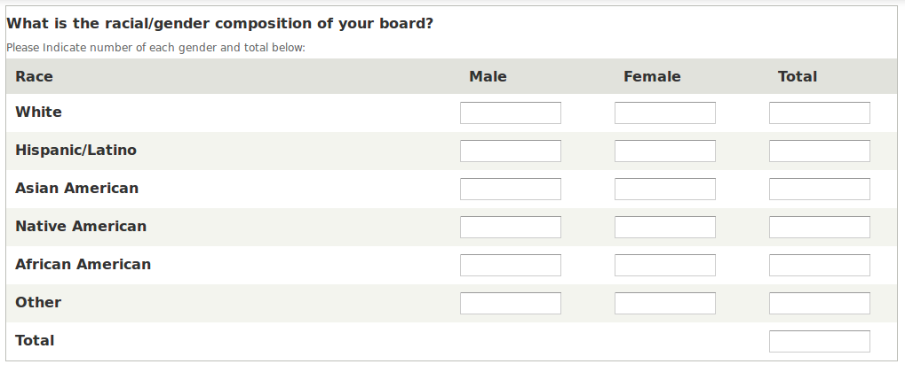
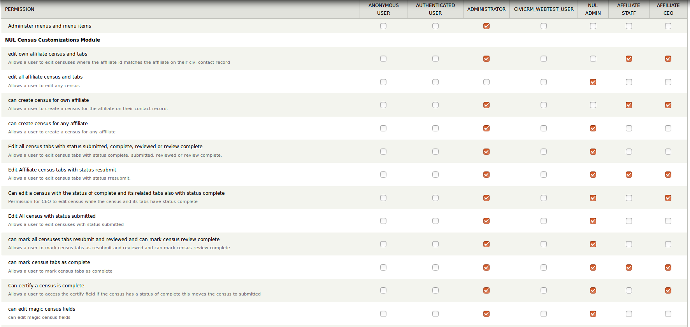
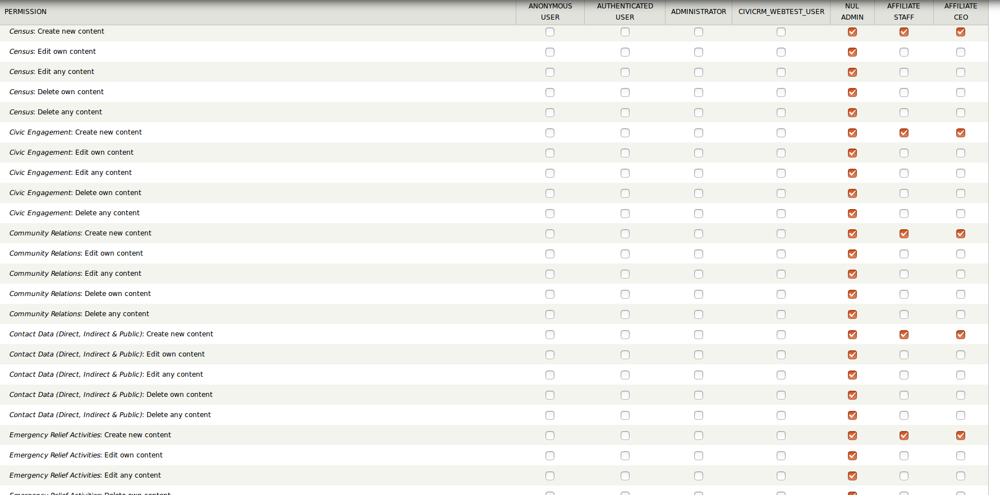

This Module:
-----------
## Fields Styled to be displayed as tables in View and Edit

Styles fields on the census to create grids to improve user experience.

### Example: "What is the racial/gender composition of your board?" Table

This is done using groups created by the [field group](https://www.drupal.org/project/field_group) drupal module) and markup fields created by the drupal module [markup](https://www.drupal.org/project/markup).

Each table is a group (of type div) with the class "nulTable"
Each row is a group with the label for the group being the first row.
Table headers are made using markup fields for the cells and the class "nulTableHeader"

Then a style sheet is added that styles the div's using the display properties: "table", "table-row" and "table-cell" to appear as a table and hides the labels. There is also code in here that creates a tooltip for each of the input fields for which the labels are hidden.

See screenshot below:

All field groups styled this way:

1. What is the racial/gender composition of your board?
2. Voter Registration fields
3. Emergency Relief Activities
4. Direct Contact, Public Contact and Indirect Contact Data (A, B and C)
5. Community Forum
6. Community Organization

## Census in create mode

When you visit: <url>/node/add/census/<affiliateId>

Custom code: hides the affiliate id, year and title fields and populates them as follows:

+ Affiliate to be the value passed as the 4th argument in the url (the civi contact id of the affiliate)
+ Year to be the current year
+ Populates the title to be the affiliate id concatenated with the year

## Census Tabs in create mode

When you visit: <url>/node/add/<censusTab>/<parentCensus>
 Set title and make it locked

 set tab status to incomplete

 set parent census to parentCensus node id passed in the url as the 4th argument

## Permissions
For Census Tabs editing:

| status            |  status submitted reviewed complete or review complete | status resubmit |  
|-------------------|--------------------------------------------------------|-----------------|
| Complete          | Yes                                                    | No              |  
| Incomplete        | Yes                                                    | Yes             |  
| Resubmit          | No                                                     | Yes             |  
| Reviewed          | Yes                                                    | No              |  
| Reviewed Complete | Yes                                                    | No              |  
| Submitted         | Yes                                                    | No              |

### NUL Census Customizations Module Permissions Configuration

### Node permissions configuration for census and census tabs

## Total-ing

Totals for tables on the following tabs:

 + Employees and Board Members: Board members table totals by race and grand total
 + Edit Contact Data (Direct, Indirect & Public): Public and Direct contact tables, totals by gender
 + Civic Engagement: Tables for Voter Registration, Community Organizations, Community Forums, CRJA, Police Brutality, Advocacy

## Taxonomy Terms

This module has an install file that creates the taxonomy terms needed for the features in NULCENSUS_FEATURES (because features does not create list terms only the vocabulary) including:

+ Census Tab Status - These terms are the status's used for the census tabs
+ Status type for Census  - These terms are the status's used for the census
+ Census Tabs - This Taxonomy maps which content types are census tabs and uses it to create the menu
+ Program Areas - Each Program is a designated Program Area, this is a field on the program and determines which census tab the program should be listed under
+ Program Types - This is a field on the program that is limited by what program area the field program is designated as
+ Services Provided - This is a field on the program that is limited by what program area the field program is designated as

## Views Block Configuration:

TODO UPDATE THESE VIEWS DESCRIPTIONS TO INCLUDE THE REPORTS

### View: Census Tab Menu:

This block produces the menu of census tabs. It uses the Taxonomy "Census Tabs" and checks for a node of the content type in the "content type machine name" field and the parent census. If it finds one it links to it with an additional url parameter of the parent census which is used by the "programs for programs area" block to display the programs. IF it does not find one it links to node/add/{content_type}/{parent_census} which will take you to add a node of that content type with the parent census field set. There are two blocks one for when you are on the Census it self and one for the census tabs.

Configuration:

+ Census Tabs (on Census)
+ Census Tabs (on Tab) -- This should be configured to only show up on the census content types.

### View: link to full census

This view creates a link to the page/view full-census (the view to see the full census) with the census id passed in the url.

Configuration: This block should be configured to only show on pages content type "Census" after full content. The block title should be set to <none>

### View: Full Parent Census

This view is to show the parent census on the page/view full-census.

Configuration: It should be configured to go above "Main page content" in the content section only on pages "full-census/ star"

### Page: Full Census

This is a view that will show all of the tabs with parent census XXX where XXX is a contextual filter passed thru the url.

Configuration: None necessary

## Sends Notification Emails

When a new census is Created

AND

When the census status changes to "completed" "Reviewed Complete" or "Submitted"

an email is sent to the following email addresses:

+ The email in the setting (Configuration-> nul census custom -> settings)
+ The two emails on the census node email address survey certifier email

# Content Types info

| Content Type                                              | Tables | Census Role         | Programs Associated w/Tab | Paragraphs |
|-----------------------------------------------------------|--------|---------------------|---------------------------|------------|
| Census                                                    | None   | Parent Census       | No                        | None       |
| Civic Engagement                                          | Yes    | Census Tab          | No                        | None       |
| Community Relations                                       | None   | Census Tab          | No                        | None       |
| Contact Data (Direct, Indirect & Public)                  | Yes    | Census Tab          | No                        | None       |
| Education Program Details                                 | None   | Program Details Tab | Yes                       | None       |
| Emergency Relief Activities                               | Yes    | Census Tab          | No                        | None       |
| Employees and Board Members                               | Yes    | Census Tab          | No                        | None       |
| Empowerment                                               | None   | Census Tab          | No                        | None       |
| Entrepreneurship and Business Development Program Details | None   | Program Details Tab | Yes                       | None       |
| Expenditures                                              | None   | Census Tab          | No                        | None       |
| Health and Quality of Life Program Details                | None   | Program Details Tab | Yes                       | Yes        |
| Housing and Community Development                         | None   | Program Details Tab | Yes                       | None       |
| Other Programs                                            | None   | Program Details Tab | Yes                       | None       |
| Programs                                                  | None   | Program             | No                        | Yes        |
| Revenue                                                   | None   | Census Tab          | No                        | Yes        |
| Service Areas                                             | None   | Census Tab          | No                        | None       |
| Volunteers/Members                                        | Yes    | Census Info         | No                        | None       |
| Workforce Development Program Details                     | No     | Program Details Tab | Yes                       | Yes        |

## Census Role's Custom Code:

For Custom code on the Parent Census (census) see "Census in create mode" section
For Custom Code on any content type with census role "Census Tab in create mode" section
For Custom Code on Programs see XXXX
For Custom Code on Program Details Tab see "Program Details Tabs"

# Program Details Tabs

If on a program details tab with the field "Do you offer Programs of this type?" Unless that field is checked all other fields are hidden.
If on a program details tab in view mode can view add program button.

# WorkFlow Documentation

## Status Changes

### Census Tabs

#### Incomplete to Complete:

All Census tabs start as Incomplete Users with proper permissions (edit own or any affiliate) will see a button on view of a tab node to mark the tab as complete

#### Complete to Submitted:

When all tabs are complete then the certify field on census will be unlocked for users with proper permissions (user can edit own or any affiliate and user can certify census is complete) when taht field is populated and the census is saved the status will be changed to submitted.

#### Submitted to Resubmit:

If user has permission 'can mark census tabs resubmit and reviewed' and is viewing a tab with status submitted there is a button at the top to click that will switch the status of the tab to resubmit

#### Resubmit to Submitted:

If user has permission to edit in resubmit also has access to resubmit button when in view mode which will change status of tab to submitted

#### Submitted to Reviewed:

If user has permission 'can mark census tabs resubmit and reviewed' and viewing a tab with status submitted there is a button at the top to click that will switch the status of the tab to reviewed

#### Reviewed to Reviewed Complete:

when user with permission clicks button on census to "Mark Census as Review Complete" (which appears when all tabs are reviewed) then the census and all tabs statuss are updated to reviewed complete

### Census

#### Incomplete to Complete:

When all tabs are complete, census status changes to complete

#### Complete to Submitted:

on submit of a census in status complete When the survey certification field is filled census status changes to submitted.

#### Submitted to Reviewed Complete

when user with permission clicks button on census to "Mark Census as Review Complete" (which appears when all tabs are marked as reviewed and the user has the permission) census and all tabs statuses are updated to reviewed complete

## Programs

Custom code when on the content type programs

### Programs in Create Mode

When on a program details tabs and the user checks yes for "Affiliate had programs of this type" then on view of the program details tab will be an add a programs button. When the user clicks add a program they will be taken to a page to create a node of the type programs with the parent census id in the url and the program area of the program details tab they are coming from. The parent census id will be used to populate the parent census field and the program area will be used to set the program area for the program and limit the options for the services provided and program types to only those for that program area.

NOTE: Programs do not have a status. they use the statuses of their program details tabs, if you can edit the program details tab you can edit the program and add new ones, if you can't edit the program details tab you can't edit or add programs
